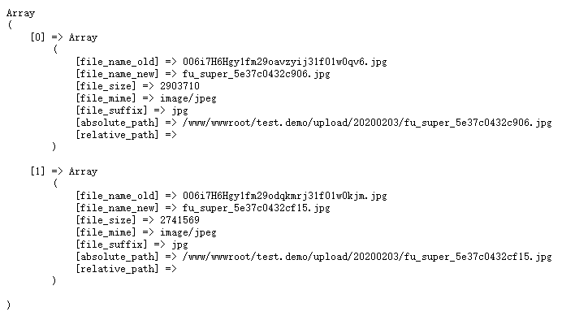

# fu-super
方便的文件上传类库

#### 安装：  
php version >= 5.6
```shell script
composer require acgmo/fu-super
```
    
#### 食用（demo）：  
```php
require 'vendor/autoload.php';

use FuSuper\Main;

# 实例对象， 传入`项目根目录路径`给构造函数， 注意是`绝对路径`
$fu_super = new Main(__DIR__);

# 设置上传所需的参数
# @param string $save_dir 文件保存目录，留空将使用 `项目根目录/upload/年月日/` 为路径
# @param array $suffix 上传文件后缀白名单
# @param int $file_size 文件大小上限， 单位MB， 默认10  
$fu_super->setConf('upload/img', array('png', 'jpeg', 'jpg', 'gif'), 20);

$file_data = $_FILES['file'];

# 开始上传
# @param array $file 通过$_FILES获取的文件数组
# @param bool $$cover 是否覆盖原有文件， 默认 false
# return bool 成功返回true， 失败返回false
$rs = $fu_super->upSave($file_data, false);

if ($rs) {
# 上传成功可以通过 $fu_super->file_info 上传后的文件信息
    echo '上传成功!';
    echo '<pre>';
    print_r($fu_super->file_info);
    echo '<hr/>';
    # 注意，如果是多文件上传，只有当全部文件上传失败才会返回false， 意思就是有一个文件上传成功，  upSave()方法会返回true
    # 这时候需要多一步判断， 看代码：
    if ($this->error_info['number'] > 0) { # error_info['number'] ,上传失败的文件数量
        print_r($this->error_info);
    }
    
    echo '</pre>';
    
} else {
# 上传失败可以通过 $fu_super->error_info 获取错误信息
    echo '<pre>';
    print_r($fu_super->error_info);
    echo '</pre>';
}

```

#### 返回的上传信息参数说明
#### 上传成功：

```php
array(
    array( #多维数组，如果只上传一个文件，索引拿 0 就可以了
        'file_name_old' => '上传前的文件名称，文件原名称',
        'file_name_new' => '上传后的文件名称，文件新名称',
        'file_size' => '文件大小, 单位是 字节(b)',
        'file_mime' => '文件MIME类型',
        'file_suffix' => '文件后缀名',
        'absolute_path' => '文件绝对路径',
        'relative_path' => '文件相对路径，就是从你项目根目录开始',
    ),
);
```
----
#### 上传失败：

```php
array(
'info' => array
(
    array( # 多维数组，如果只上传一个文件，索引拿 0 就可以了
        'code' => '错误代码',
        'msg' => '错误原因说明',
        'file_name' => '文件名称',
    )
),
'number' => '上传失败的文件数量',
'msg' => '共有 * 个文件上传失败！', # 感觉这个字段有点多余……
);

```